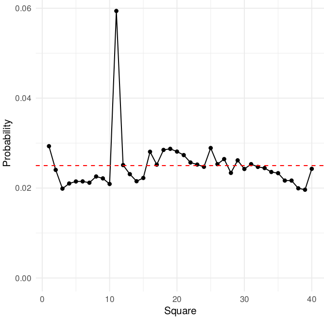

# Programming: Practical 6

\noindent{We wish to determine the properties on which a player is most likely to land during a game of Monopoly. To simplify things, we assume there is only a single player, ignore everything to do with money and also ignore the `Get out of Jail Free Cards'.}

# Monopoly: overview of the problem

The algorithm we will use is:

1. Begin the game on GO;

2. `current` = `current` + dice roll

3. Make a note of the new position.

   - If we land on `Chance' or 'Community Chest', draw a card;
   
   - If we land on `Go To Jail', move to Jail;
   
   - If we move, make a note of the new position;
   
4. Go back to step 2.

\noindent After rolling the dice 100,000 times or so, stop.

# Dice Rolling

When we roll a single die, each side has an equal probability of occurring. This means we can use the `sample()` function to simulate a die roll:

```{r, echo=TRUE}
sample(1:6, 1)
```

\noindent To roll two dice, we simply call this function:

```{r, echo=TRUE}
roll_two_dice = function() {
total = sample(1:6, 1) + sample(1:6, 1)
return(total)
}
```

## The Monopoly board

In Monopoly there are forty properties or squares, see table \ref{T_1} at the end of this practical for a complete list. If we set the first square ‘Go’ to be number 1, then we can represent all forty squares as a vector in R. For example

```{r, echo=TRUE, tidy = FALSE}
## This creates a vector of 40 values;
## All values are initially zero
landings = numeric(40)
```

\noindent Then, when we land on a square we simply increase the associated
`landings` entry by one. Suppose we landed on ‘Old Kent Rd’, we
would represent this as:

```{r, echo=TRUE}
landings[2] = landings[2] + 1
```

\noindent since ‘Old Kent Road’ is square 2 (see table \ref{T_1}).

## Going round the board

Our first go at simulating Monopoly will ignore community chest,
chance cards, and the ‘Go To Jail’ square. This means that we are
simply going round the board. The code in the `simulate_monopoly()`
function, rolls the dice `no_of_rolls` time, and stores the squares that
are landed on in the vector `landings`.

```{r, echo=TRUE}
simulate_monopoly = function(no_of_rolls) {
  landings = numeric(40)
  ## Start at GO
  current = 1
  for (i in 1:no_of_rolls) {
    current = current + roll_two_dice()
    if (current > 40) {
      current = current - 40
    }
    landings[current] = landings[current] + 1
  }
  return(landings)
}
no_of_rolls = 50000
```

\noindent We can then call the function using:

```{r, echo=TRUE}
sim = simulate_monopoly(no_of_rolls)
```

```{r, echo=FALSE}
# no_of_rolls = 2000000
# sim1 = SimulateMonopoly(no_of_rolls)
# saveRDS(sim1, file="vignettes/sim1.RData")
sim = readRDS("sim1.RData")
```

\noindent We can then plot the results

```{r, echo=TRUE, fig.keep='all', fig.margin=TRUE, fig.cap="Probability of landing on a Monopoly square.", tidy = FALSE}
library("ggplot2")
library("tibble")
monopoly = tibble(index = seq_along(sim), sim = sim / sum(sim))
ggplot(monopoly) +
  geom_line(aes(x = index, y = sim)) +
  ylim(0, 0.06) +
  labs(x = "Square", y = "Probability")
```

## Incorporating Community Chest Cards

There are three community chest squares on the board - squares 3, 18
and 34. In the code below we will just consider square 3. There are sixteen cards in total, hence the probability of drawing any particular
card is 1/16. In the code below we will **only implement the first two
community chest cards:**

```{r, echo=TRUE}
community_chest = function(current) {
  goto = current
  u = runif(1)
  if (u < 1 / 16) {
    goto = 1 #Move to Go
  } else if (u < 2 / 16) {
    goto = 11 #Go To Jail :(
  }
  return(goto)
}
```

\noindent This function takes in the `current` position, with probability 1/16
we ‘Move to Go’, with probability 1/16 we ‘Go to Jail’ and with
probability 14/16 we stay in our current position. We now alter the
`simulate_monopoly()` function to incorporate the `community_chest()` function:

```{r, echo=TRUE}
simulate_monopoly = function(no_of_rolls) {
  landings = numeric(40)
  ## Start at GO
  current = 1
  for (i in 1:no_of_rolls) {
    current = current + roll_two_dice()
    if (current > 40) {
      current = current - 40
    }
    landings[current] = landings[current] + 1
    if (current == 3) {
      cc_move = community_chest(current)
      if (cc_move != current) {
        current = cc_move
        landings[current] = landings[current] + 1
      }
    }
  }
  return(landings)
}
```

\noindent{We can then call this function:}

```{r, echo=TRUE}
sim2 = simulate_monopoly(no_of_rolls)
```

```{r, echo=FALSE}
# no_of_rolls = 2000000
# sim2 = SimulateMonopoly(no_of_rolls)
# saveRDS(sim2, file="vignettes/sim2.RData")
sim2 = readRDS("sim2.RData")
```

\noindent and plot

```{r, echo=TRUE, fig.keep='all', fig.margin=TRUE, fig.cap="Probability of landing on Monopoly square with the first community chest card implemented. Incorporating a single cummunity chest card has very little effect. For this graphic, I used 2 million simulations!", tidy = FALSE}
monopoly2 = tibble(index = seq_along(sim2),
                   sim = sim2 / sum(sim2))
ggplot(monopoly2) + 
  geom_line(aes(x = index, y = sim)) + 
  ylim(0, 0.06) +
  labs(x = "Square", y = "Probability")
```

\noindent What is the rationale for lines 14-20?

# Additional questions

Each question adds an additional layer of complexity to your code. The code below contains two functions that will help you with the questions below.

```{r}
##Helper function to avoid code replication
check_state = function(current) {
  if (current > 40) {
    current = current - 40
  } else if (current < 1) {
    current = current + 40
  }
  return(current)
}

update_state_vector = function(current, move, landings) {
  if (move != current) {
    landings[current] = landings[current] + 1
  }
  return(landings)
}
```

1. Add in the two other community squares, i.e. squares 18 and 34
into the `simulate_monopoly()` code.

2. Add in ‘Go to Old Kent Road’ into your `community_chest()` function.

3. Square 31 is ‘Go To Jail.’ Implement this in your main `simulate_monopoly()` function.

4. Create a `chance()` function, that implements the first six Chance
cards. When you land on a Chance square, call this function.

5. Add in Community Chest card four.

6. Add in Chance card 8.

7. Add in Chance card 7, ‘Go back 3 spaces’.

8. Rolling a double (a pair of 1’s, 2’s, ..., 6’s) is special:
    
    (a) Roll two dice (`total1`): `total_score = total1`
    
    (b) If you get a double, roll again (`total2`) and `total_score =
    total1 + total2`
    
    (c) If you get a double, roll again (`total3`) and `total_score =
    total1 + total2 + total3`
    
    (d) If roll three is a double, Go To Jail, otherwise move
    `total_score`


```{r}
roll_two_dice_with_doubles = function(current) {
  df = data.frame(d1 = sample(1:6, 3, replace = TRUE),
                  d2 = sample(1:6, 3, replace = TRUE))
  df$Total = apply(df, 1, sum)
  df$IsDouble = df$d1 == df$d2
  if (df$IsDouble[1] & df$IsDouble[2] & df$IsDouble[3]) {
    current = 11#Go To Jail
  } else if (df$IsDouble[1] & df$IsDouble[2]) {
    current = current + sum(df$Total[1:2])
  } else {
    current = current + df$Total[1]
  }
  return(current)
}
```

```{r}
# Answers for community chest and chance questions
community_chest = function(current) {
  u = runif(1)
  goto = current #Default. Do nothing
  if (u < 1 / 16) {
    goto = 1 #Go
  } else if (u < 2 / 16) {
    goto = 11 #Jail
  } else if (u < 3 / 16) {
    goto = 2 #Old Kent Rd
  } else if (u < 4 / 16) {
    goto = chance(current)
  }
  return(goto)
}

chance = function(current) {
  u = runif(1)
  goto = current #Default. Do nothing
  if (u < 1 / 16) {
    goto = 1 # Go
  } else if (u < 2 / 16) {
    goto = 25 #Tra Square
  } else if (u < 3 / 16) {
    goto = 12 #Pall Mall
  } else if (u < 4 / 16) {
    goto = 11 #Jail
  } else if (u < 5 / 16) {
    goto = 16 #Mary' Stat
  } else if (u < 6 / 16) {
    goto = 40 #Mayfair
  } else if (u < 7 / 16) {
    goto = check_state(current - 3) #Must check, since goto maybe negative!
  } else if (u < 8 / 16) {
    if (current > 29
        | current < 13) {
      goto = 13
    } else {
      goto = 29
    }
  }
  return(goto)
}
```
```{r}
simulate_monopoly = function(no_of_turns) {
  landings = numeric(40)
  ##Start GO
  current = 1
  for (i in 1:no_of_turns) {
    current = roll_two_dice_with_doubles(current)
    current = check_state(current)
    landings = update_state_vector(current, -1, landings)
    if (current == 8 | current == 23 | current == 37) {
      #Chance
      move = chance(current)
      landings = update_state_vector(move, current, landings)
      current = move
    }
    if (current == 3 | current == 18 | current == 34) {
      #Community Chest
      move = community_chest(current)
      landings = update_state_vector(move, current, landings)
      current = move
    }
    ##Go To Jail. Chance could also send you here by
    ##going back three places
    if (current == 31) {
      current = 11
      landings = update_state_vector(current, -1, landings)
    }
  }
  return(landings)
}
```

```{r, fig.cap="Hi", echo = FALSE, out.width="0.8\\textwidth", out.height="60%", fig.pos="!h", fig.align='center'}

```

# Additional Information

## Community Chest Cards

There are three community chest areas on the board (see Table \ref{T_1}). In total, there are 16 community chest cards.

1. Advance to Go;

2. Go to jail;

3. Go to Old Kent Road;

4. Take a Chance card instead;

## Chance Cards

A Chance card is most likely to move players. There are three chance
areas on the board (see Table \ref{T_1}). There are 16 chance cards in total, of which eight cards move the player:

1. Advance to Go;

2. Advance to Trafalgar Square;

3. Advance to Pall Mall;

4. Go directly to Jail;

5. Take a trip to Marylebone Station;

6. Advance to Mayfair;

7. Go back 3 spaces;

8. Advance token to nearest Utility. The utility squares are the water
works and the electric company.

\begin{table}[!b]
  \resizebox{\textwidth}{!}{%
    \centering
    \begin{tabular}{@{}llll@{}}
      \toprule
      Square Number & Name & Square Number & Name \\
      \midrule
1 & Go & 11 & Jail  \\
2 & Old Kent Road & 12 & Pall Mall \\
3 & {\color{blue} Community Chest} & 13 & Electric Company \\
4 & WhiteChapel Road & 14 & Whitehall \\
5 & Income Tax & 15 & Northumberland Avenue \\
6 & King's Cross Station & 16 & Marylebone Station \\
7 & The Angel Islington & 17 & Bow Street \\
8 & {\color{red} Chance} & 18 & {\color{blue} Community Chest} \\
9 & Euston Road & 19 & Marlborough Street \\
10 & Pentonville Road & 20 & Vine Street \\
\midrule
21 & Free Parking & 31 & Go To Jail \\
22 & Strand & 32 & Regent Street \\
23 & {\color{red} Chance} & 33 & Oxford Street \\
24 & Fleet Street & 34 &  {\color{blue} Community Chest} \\
25 & Trafalgar Square & 35 & Bond Street \\
26 & Fenchurch Street Station & 36 & Liverpool St Station \\
27 & Leicester Square & 37 & {\color{red} Chance} \\
28 & Coventry St & 38 & Park Lane \\
29 & Water Works & 39 & Super Tax \\
30 & Piccadilly & 40 & Mayfair \\
\bottomrule
\end{tabular}}
\caption{Monopoly squares with associated square numbers}\label{T_1}
\end{table}

# Solutions

Solutions are contained within this package:

```{r, eval=FALSE, echo=TRUE}
vignette("solutions6", package = "jrProgramming")
```
